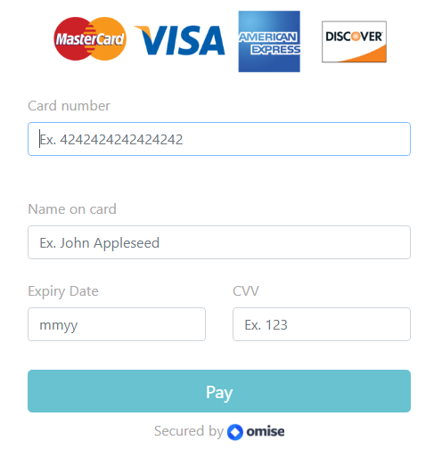
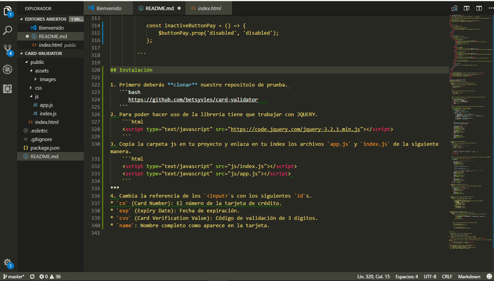

# "Validador de datos de tarjetas de crédito"

Es una librería que permite `validar una tarjeta de crédito`
(usando algoritmo de Luhn), `fecha de vencimiento`, `código de verificación (cvv)` y `nombre completo` que aparece en la tarjeta.


## Desarrollado para 

[Laboratoria](http://laboratoria.la)

## Objetivo

  Desarrollar una librería para validar tarjetas de crédito

***
## Plan de trabajo

#### 1. Decisión del reto a desarrollar.

#### 2. Se realiza un `Fork` al repositorio original

```
https://github.com/Laboratoria-learning/card-validator
```

#### 3.Planificación

Se planifico las actividades a desarrollar mediante issues para identificar los problemas y además asignar tareas a los colaboradores de dicho proyecto con el fin de tener una mejor organización.


#### 4. Recursos

##### 4.1. Babel
Herramienta para poder transformar nuestro código JS de ultima generación.

##### 4.2. Visual Studio Code
Editor de código fuente.

##### 4.3. Jquery
Librería de JavaScript de código abierto que permite agregar interactividad y efectos visuales.

##### 4.4. Bootstrap
 Framework que permite facilitar el desarrollo.

##### 4.5. Google Fonts
Directorio interactivo que permite añadir tipografias a la web.

#### 5. Desarrollo de la librería
* Inicializando proyecto con `npm init` y `git init`.
* Instalación de las dependencias package.json y Babel.
* Estructuración de carpetas
* Creación  `.gitignore`(para ignorar carpetas).

```
# Dependency directories
node_modules/
```

* Creación del `index.html`.
* Maquetación para el ejemplo principal


 ***

* Creación de los issues.
* Implementación de la funcionalidad esencial.

  * Validación de la tarjeta de crédito (usando algoritmo de Luhn).
    * Objetivos:
      * Definir una función que solo permita el ingreso de solo números.
      ```js
       const onlyNumberCard = (num) => {...};
      ```
      * Definir una función que permita ingresar solo 16 caracteres.
       ```js
       const maxLengthCard = (num) => {...} 
       ```
      * Definir una función que permita ver el tipo de tarjeta de crédito (Visa, Mastercard).
      ```js
       const validateTypeCard = (num, images) => {...};
      ```
      * Definir una función que permita validar el número de tarjeta de crédito según Luhn.
      ```js
       const validateNumberCard = (num, input, images) => {...};
      ```
  * Validación de la fecha de vencimiento.
    * Objetivos:
      * Definir una función que permita solo números retroceso y enter.
      ```js
       const onlyNumber = (evt) => {...};
      ```
      * Definir una función que permita verificar que la fecha escrita sea corresta según el formato MMYY.
      ```js
       const validateDate = (date, input, sentence) => {...};
      ```
  *  Validación del código de verificación (cvv).
    * Objetivos:
      * Definir una función que acepte solo 3 dígitos para el código de seguridad.
      ```js
       const validateCode = (cvv, input) => {...};
      ```
  * Validación del nombre completo que aparece en la tarjeta.
    * Objetivos:
      * Definir una función que permita validar el nombre.
        ```js
        const validateName = (name, input) => {...};
        ```

* Implementación de la funcionalidad opcional.
  * Validación de todos los campos y activación del button (Pay)
    * Objetivos:
        * Definir una función que permita validar todos los campos (inputs) y active el button.
         ```js
                const areAllValidationsPassing = () => {}               
         ```
        * Definir una función que permita activar y desactivar el button.
         ```js
            const formStateEvent = () => {...};

            const inactiveButtonPay = () => {...};

         ```
***
## Instalación...!!!

1. Primero deberás **clonar** nuestro repositorio de prueba. 
   ```bash
      https://github.com/betsyvies/card-validator   
   ```
2. Para poder hacer uso de la librería tiene que trabajar con JQUERY.
    ```html
    <script type="text/javascript" src="https://code.jquery.com/jquery-3.2.1.min.js"></script>
    ```
3. Copia la carpeta js en tu proyecto y enlaza en tu index los archivos `app.js` y `index.js` de la siguiente manera.
    ```html
    <script type="text/javascript" src="js/index.js"></script>
    <script type="text/javascript" src="js/app.js"></script> 
    ```

4. Cambia la referencia de los `<input>`s con los siguientes `id`s.
* `cn` (Card Number): El número de la tarjeta de crédito.
* `exp` (Expiry Date): Fecha de expiración.
* `cvv` (Card Verification Value): Código de validación de 3 dígitos.
* `name`: Nombre completo como aparece en la tarjeta.
***
## Funcionalidad



***

## Colaboradores

* Carla centeno
* Betsy Vidal
* Eleyne Ramírez
